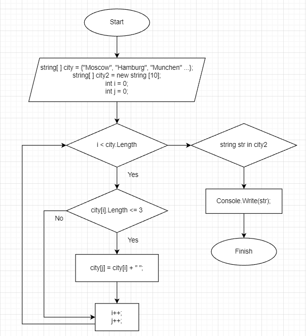

## Блок-схема решения итоговой задачи:
***

***
## Описание решения:
**Для решения задачи было создано два массива, один заполненный строками, другой пустой. Переменные i и j для обращения к индексу заполненного и пустого массива соответственно. Также переменная i выступает в качестве счетчика в первом логическом условии "while" - i < city.Length.**

**Для определения ключевого условия задачи: "длина которых меньше или равна 3 символа" - было решено сделать логическое условие "if" внутри цикла "While" - city[i].Length <= 3, и если условие выполняется, то массив "city2" индекса j принимает значение массива "city" индекса i.**
